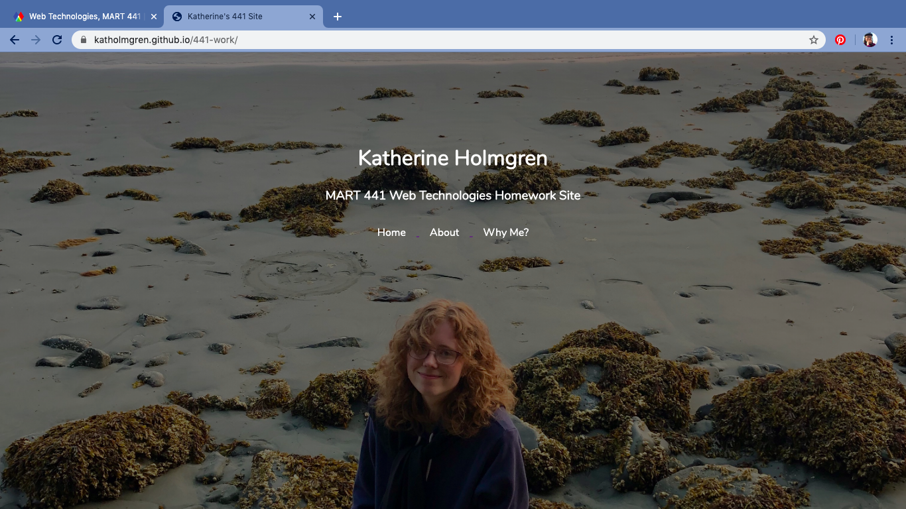

Katherine Holmgren

January 21, 2020

# HW-1 Response

[HW-1 Live Link](https://katholmgren.github.io/441-work/)

For this week's homework, we were to create a starting place for our consulting website. I decided to go with a basic hero image and descriptions below. I used a medium closeup portrait of myself so the navigation menu would align over my head. I liked the natural color palette of the beach, so I decided to base the webpage typeface and colors off of it. I liked the addition of parallax scrolling-- it was much easier to implement than I expected.

### Process

This was my work cycle for HW-1. Throughout this process, I pushed my work to GitHub to see how the page would look on a mobile device.

1. Setup repo structure
2. index.html
3. Connect to style stylesheet
4. Hero image
5. Padding content
6. Parallax scrolling
7. Navigation menu
8. Breakpoints
9. Footer

### Difficulties

I was apprehensive about this homework after seeing how fancy the example webpage looked. But as I progressed, I was amazed at how straightforward it was to implement the hero image, parallax scrolling, and navigation menu. My webpage turned out much better than I had expected.

I had difficulty making my webpage mobile responsive. I hadn't heard of breakpoints before, and though I understand their basic function now, I don't know how to use them to their potential. I'd like to learn more about grids and how to create grids for different screen sizes.

### Summary

I think this webpage looks the best out of the other sites I've made in college. I learned a lot, which is great considering this was the first week of class. I think it will be a good starting place for future assignments and a portfolio.

