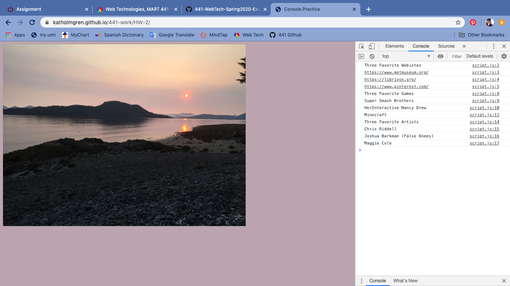

Katherine Holmgren

January 25, 2020

# HW-2 Response

[HW-2 Live Link](https://katholmgren.github.io/441-work/HW-2)

In this week's homework cycle, we learned about the JavaScript Console. We had to make a webpage that displayed our three favorite websites, games, and artists in the console. This was review for me from Creative Coding 1, although I didn't realize that other people can see what is written in the console. I had no difficulties during this assignment. I will likely review the last few weeks from MART 341 this weekend.

