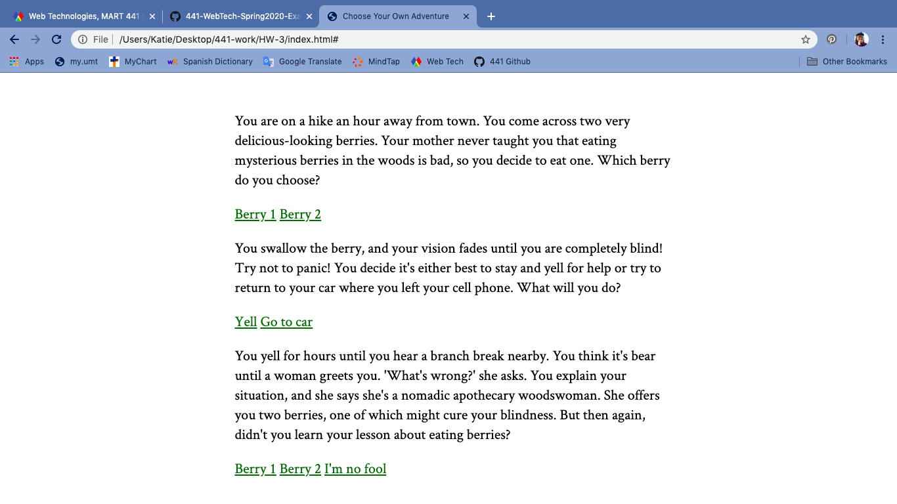

Katherine Holmgren

February 3, 2020

# HW-3 Response

[HW-3 Live Link](https://katholmgren.github.io/441-work/HW-3)

For this week's homework, we were to create a Choose Your Own Adventure by updating the DOM. This was a difficult assignment for me, but I like Choose Your Own Adventures so it wasn't too bad. I spent too much time working on incorrect code, but the process reminded me of what I learned in Creative Coding 1. I tend to make things more complicated than they are.

To be honest, I ran out of time. I put images in a folder, but it would take too long to make them work with the rest of the code. Maybe I'll put them in later. I wanted to go with a black and white Edgar Allen Poe type of theme.

### Process

1. Plan story
2. Draw story choice outline, convert to code outline
3. Work on the wrong things
4. Put if statements inside one function
5. Put innerHTML strings into variables
6. Styling
7. Check grammar
8. Ran out of time

### Difficulties

I can understand what functions, if statements, and variables do, but I have a hard time seeing how they work together. I got on the wrong track this assignment by overcomplicating how they work together. For example, I was trying to put if statements inside if statements inside if statements. I also made functions for each choice before I learned I only needed one. I wasted a lot of time.

### Successes
It was such a relief once I got the links to go to their sub-links. After that, the process was much less frustrating. I ran out of time to do everything I wanted, but I was happy with the little styling I got to implement. I also liked playing around with the story.

