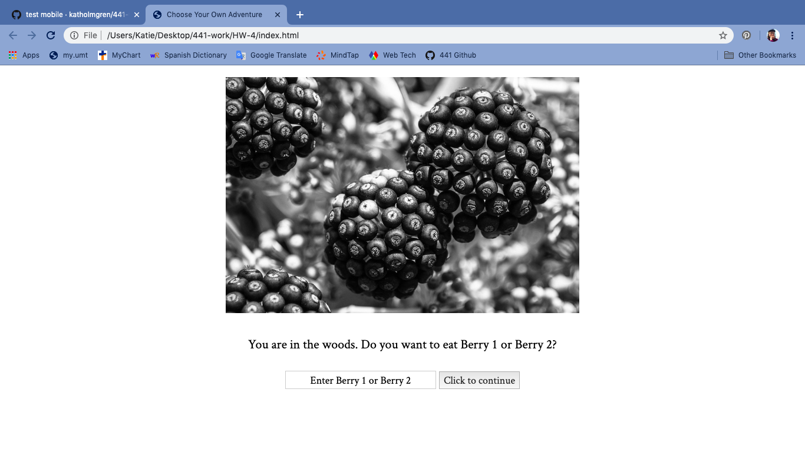

Katherine Holmgren

February 10, 2020

# HW-4 Response

[HW-4 Live Link](https://katholmgren.github.io/441-work/HW-4)

For this week's homework, we added to the Choose Your Own Adventure we made last week, incorporating text boxes and a play again option. I comprehended the material much better than last week and was able to work more efficiently. I also worked the images in this week.

### Process

1. Study example and class material
2. Merge story to correct format
3. Troubleshooting display none/block
4. Adding images
5. Adding play again function
6. Grammar
7. Styling

### Difficulties

Once again, I had difficulty styling. I tried to make the story mobile responsive, but I couldn't get it to work. Eventually, I switched back to the original CSS file. Another bug I couldn't fix was that the text box and button aligned left after submitting an answer. I'll have to go back and review some CSS chapters from the Intro to Web Design course textbook.

Overall, I like the story I made. I'm going to make my roommates play it.

