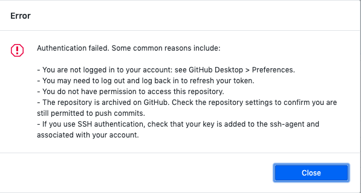

Katherine Holmgren

February 17, 2020

# HW-5 Response

[HW-5 Live Link](https://katholmgren.github.io/441-work/HW-5)

For this week's homework, we started to make a matching game based on a grid. For me, the majority of the work was planning an aesthetic, and drawing and editing the photos. I enjoyed this process and am satisfied with how the images look together. As for the coding, I was able to adapt the example to match how I wanted the web page to look. This was straightforward, and I plan on looking at the code again tonight to make sure I understand everything.

### Process

1. Draw and edit images
2. Edit the class example
3. Trouble with gitHub Desktop
4. Study code in depth

### Difficulties

It was nice having an easier assignment this week for the three day weekend. I understand this week's course material, but I don't think I could make the homework without using the example. I'll study the example tonight. Most of my difficulties were with gitHub Desktop. I'm getting the following error that won't let me push my work to github.com:

Following their suggestions hasn't worked yet.

I had the same problem last week, but I fixed it by reinstalling the app. Now it's not working again.  I'll just upload my work from the website this week.
