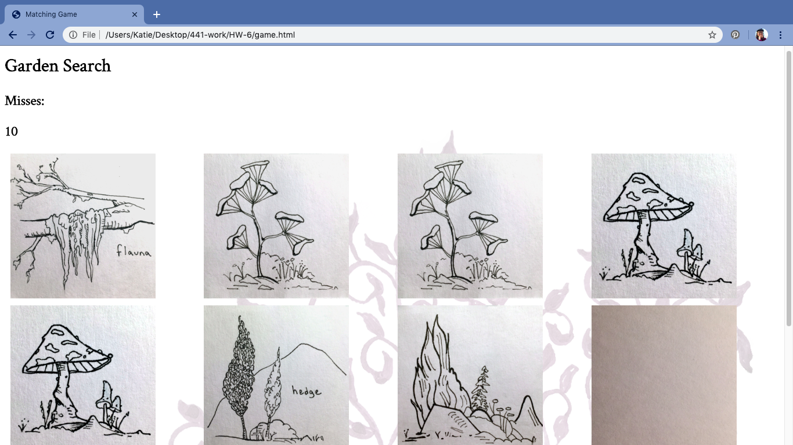

Katherine Holmgren

February 25, 2020

# HW-6 Response

[HW-6 Live Link](https://katholmgren.github.io/441-work/HW-6)

For this week's homework, we added to the memory game we started last week by using JSON to display the player's name and score on a results page. I understood how everything worked by the end of the homework, although this week took a healthy amount of trial and error. Hopefully, I'll get some remaining bugs worked out tonight so I can have my friends play it.

### Process

1. Studied example and class materials
2. Set up cards to flip/stay depending on a match
3. Linked starting index.html file to game.html file
4. Set up miss/attempt score counter
5. Got game.html to move to results.html if all cards are flipped
6. Transferred JSON text input info to results.html page
7. Transferred miss/attempt score info to results.html page
8. Troubleshooting
9. Added a background to the stylesheet (which seems to make the game harder)

### Difficulties

I had a little difficulty in every step of the process, but not enough to make me throw my computer against the wall. I had the most trouble displaying the player and score information on the results page (JSON). I couldn't figure out how to make input from the text boxes on index.html and the changing score on game.html work together.

Overall, I'm happy with the game aesthetics and functionality. It was challenging enough to make success feel fulfilling, but it was hard to the point of extreme frustration.

