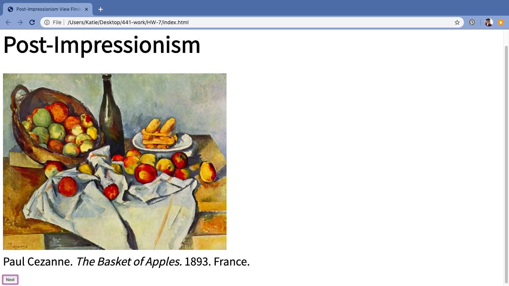

Katherine Holmgren

March 1, 2020

# HW-7 Response

[HW-7 Live Link](https://katholmgren.github.io/441-work/HW-7)

We made a viewfinder for this week's homework using classes and objects. I remember object-oriented programming from Creative Coding 1 and find it easier to understand than the top-to-bottom coding we've done so far. It's like using a stamp-- you make the mold, then press it down however many times you want, wherever you want, and in different colors. As someone who is a visual learner and a crafter, object-oriented programming feels like making things as opposed to writing an essay.

### Process

1. Set up files
2. Download images
3. Make Class
4. Make individual objects
5. Assign to a random number
6. Fix text descriptions and styling

### Difficulties

I had some trouble wrapping my head around how to move the information to the next page. I was wondering if I should make multiple arrays, but then after I rewatched the example video and heard we were only supposed to use one, I figured it fairly easily. The only other difficulty I had was making the painting location show up. But it turned out this was only because I had a mislabeled ID.

