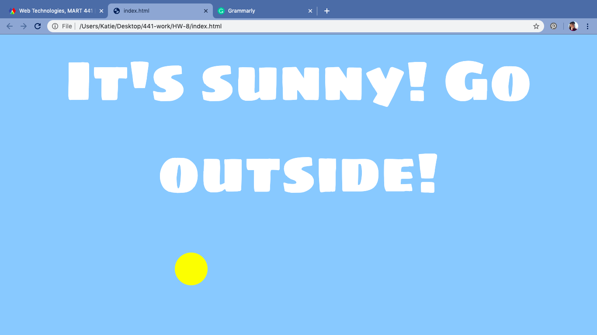

Katherine Holmgren

March 9, 2020

# HW-8 Response

[HW-8 Live Link](https://katholmgren.github.io/441-work/HW-8)

We used JQuery in this week's homework for the first time. I liked using JQuery because it made coding in JavaScript much simpler. I was able to make something complex without as much time or logic. Since we had to have elements fade in and out in this assignment, I decided to use clouds because they naturally fade in and out in the real world.

### Process

1. Set up files
2. Downloaded images
3. Put temporary borders on clouds in CSS for easy identification
4. Placed clouds in the correct starting places
5. Moved clouds around in JQuery
6. Added ending text
7. Added beginning text
8. Added sun

### Difficulties

I didn't have too many difficulties in this assignment. The most trouble I had was figuring out the right way to hide and show elements. I'm also not very confident in using JQuery with JavaScript and object-oriented programming. That's why I focused on only using JQuery this week.

